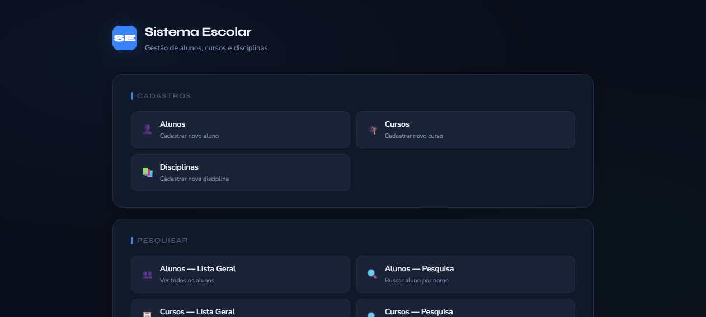
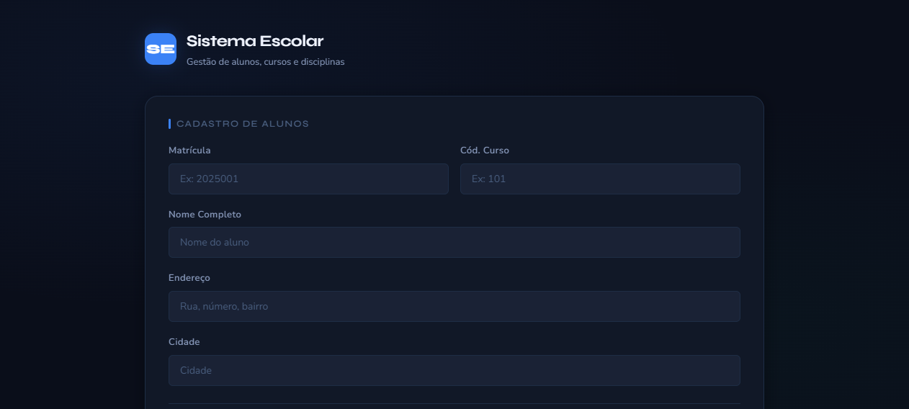
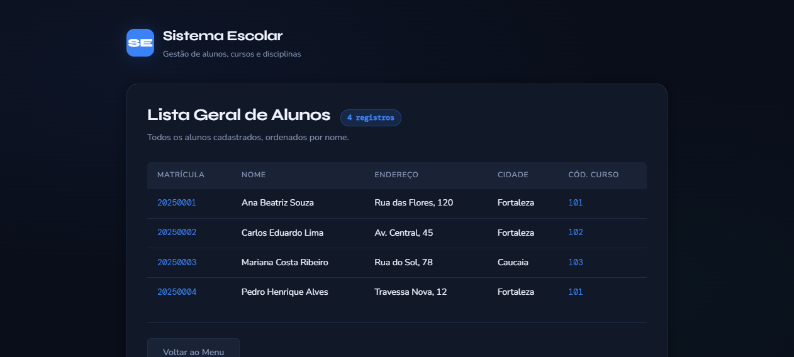
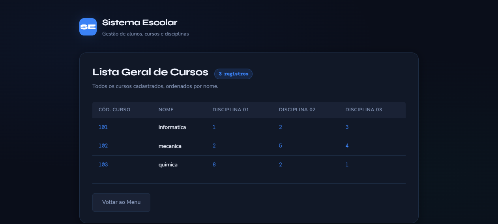

# 🎓 Sistema Escolar

Sistema web de gestão escolar desenvolvido com **PHP**, **MySQL** e **HTML/CSS**.  
Permite cadastrar e consultar alunos, cursos e disciplinas através de uma interface moderna.

---


## 🚀 Funcionalidades

- ✅ Cadastro de alunos, cursos e disciplinas
- ✅ Listagem geral de todos os registros
- ✅ Pesquisa por nome com filtro dinâmico (SQL LIKE)
- ✅ Mensagens de erro amigáveis (ex: matrícula duplicada)
- ✅ Interface responsiva com design dark mode

---

## 📸 Screenshots

| Menu principal | Cadastro de alunos |
|---|---|
|  |  |

| Lista geral de alunos | Lista geral de cursos |
|---|---|
|  |  |

---

## 🛠️ Tecnologias utilizadas

| Tecnologia | Uso |
|------------|-----|
| PHP        | Lógica do servidor, conexão com banco, INSERT e SELECT |
| MySQL      | Armazenamento dos dados (tabelas aluno, curso, disciplina) |
| HTML5      | Estrutura das páginas e formulários |
| CSS3       | Estilização com variáveis, grid e animações |

---

## 🗄️ Estrutura do banco de dados

O banco `escola` possui 3 tabelas:

```
aluno
├── matricula (PK)
├── nome
├── endereco
├── cidade
└── codcurso (referência ao curso)

curso
├── codcurso (PK)
├── nome
├── coddisciplina01
├── coddisciplina02
└── coddisciplina03

disciplina
├── coddisciplina (PK)
└── nome_disciplina
```

---

## ⚙️ Como rodar o projeto

### Pré-requisitos
- [XAMPP](https://www.apachefriends.org/) ou [WAMP](https://www.wampserver.com/) instalado
- PHP 7.4 ou superior
- MySQL 5.6 ou superior

### Passo a passo

**1. Clone o repositório**
```bash
git clone https://github.com/seu-usuario/sistema-escolar.git
```

**2. Copie a pasta para o servidor local**
```
# XAMPP → cole em:
C:/xampp/htdocs/sistema-escolar/

# WAMP → cole em:
C:/wamp64/www/sistema-escolar/
```

**3. Crie o banco de dados**
- Abra o phpMyAdmin: `http://localhost/phpmyadmin`
- Clique em **Importar**
- Selecione o arquivo `bd/escola.sql`
- Clique em **Executar**

**4. Acesse no navegador**
```
http://localhost/sistema-escolar/
```

---

## 📁 Estrutura de arquivos

```
sistema-escolar/
│
├── bd/
│   └── escola.sql              # Script de criação do banco de dados
│
├── estilo.css                  # CSS central — identidade visual do sistema
├── conexao.php                 # Conexão com o banco MySQL
├── index.php                   # Menu principal
│
├── cadalunos.html              # Formulário de cadastro de alunos
├── cadalunos.php               # Processa o cadastro de alunos
│
├── cadcurso.html               # Formulário de cadastro de cursos
├── cadcursos.php               # Processa o cadastro de cursos
│
├── caddisciplina.html          # Formulário de cadastro de disciplinas
├── caddisciplina.php           # Processa o cadastro de disciplinas
│
├── pesquisageral.php           # Lista todos os alunos
├── consulta_aluno.html         # Formulário de pesquisa de alunos
├── aluno_geral.php             # Resultado da pesquisa de alunos
│
├── geralcurso.php              # Lista todos os cursos
├── consulta_curso.html         # Formulário de pesquisa de cursos
├── curso_geral.php             # Resultado da pesquisa de cursos
│
├── geraldisciplina.php         # Lista todas as disciplinas
├── consulta_disciplina.html    # Formulário de pesquisa de disciplinas
└── nome_geral.php              # Resultado da pesquisa de disciplinas
```

---

## 📅 Histórico do projeto

**2018 — Versão original**  
Desenvolvido durante o curso técnico em Informática. Primeira experiência prática
com PHP e MySQL — formulários, conexão com banco de dados e consultas SQL básicas.

**2026 — Revisão e melhorias**  
Ao revisitar o projeto, identifiquei problemas e apliquei correções:

- 🔧 Corrigidos links quebrados que geravam erro 404 no menu
- 🔧 Corrigido botão "Limpar" que apontava para pasta inexistente
- 🔧 Substituídas mensagens de erro técnicas do MySQL por mensagens legíveis
- 🔧 Corrigidos títulos de páginas que estavam com labels trocadas
- 🔧 Adicionada validação `required` nos campos obrigatórios dos formulários
- 🔧 Corrigida inconsistência no nome da coluna `endereço` entre SQL e PHP
- ✨ Interface completamente redesenhada com CSS moderno (dark mode, grid, variáveis)
- ✨ Adicionado feedback visual: contagem de registros, mensagem de resultado vazio
- ✨ Código documentado com comentários explicativos em cada arquivo

---

## 💡 O que aprendi desenvolvendo este projeto

**Em 2018 — conceitos fundamentais:**
- Conexão PHP com MySQL usando `mysqli`
- Envio e recebimento de dados via formulários HTML com `$_POST`
- Consultas SQL: `SELECT`, `INSERT`, `ORDER BY`, `LIKE`
- Separação entre página de formulário (HTML) e processamento (PHP)

**Na revisão — boas práticas:**
- Identificar e corrigir bugs em código próprio após tempo afastado
- Tratamento de erros do banco (código 1062 = chave primária duplicada)
- Organização e padronização visual com CSS centralizado
- Importância de mensagens de feedback claras para o usuário

---


## 👨‍💻 Autor

Feito por **Rikelme Oliveira**  
📧 rikelmemini100@gmail.com  
🔗 [www.linkedin.com/in/rikelme-oliveira-dev]

---

> Projeto original de 2018, revisado e atualizado como parte da evolução contínua
> no aprendizado de desenvolvimento web.